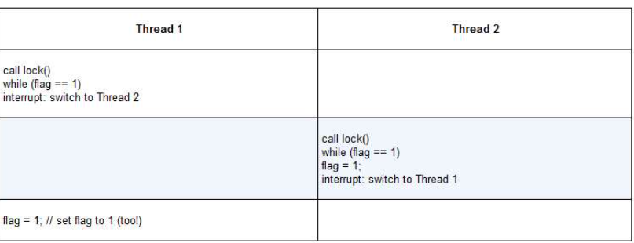

## 并发介绍
&ensp;&ensp;每个线程类似于独立的进程，只有一点区别：它们共享地址空间，从而能够访问相同的数据<br/>
&ensp;&ensp;每个线程都有一个程序计数器，用于记录程序从哪里获取指令。<br/>
&ensp;&ensp;对于进程，我们将状态保存到进程控制块（PCB），现在，我们需要一个或多个线程控制块，保存每个线程的状态，与进程相比，线程之间上下文切换有一点主要区别：地址空间保持不变。<br/>
&ensp;&ensp;
### 1.线程创建
&ensp;&ensp;程序见t0.c，执行后会发现结果是不确定的，线程的创建有点像进行函数调用。然而，并不是首先执行函数然后返回给调用者，而是为被调用的例程创建一个新的执行线程，它可以独立于调用者运行，可以在创建者返回之前运行，但也许会晚很多。
### 2.锁
&ensp;&ensp;并发的基本问题：希望原子式执行一系列指令，但由于单处理器的中断，这很难做到。<br/>
&ensp;&ensp;锁就是一个变量。这个锁变量保存了锁在某一时刻的状态，它要么是可用的，（available）表示没有线程持有锁，要么被占用的（acquired）表示有一个线程持有锁。<br/>
&ensp;&ensp;lock()和unlock()函数，调用lock（）尝试获取锁，如果没有其他线程持有锁，该线程会获得锁，进入临界区。一旦调用unlock（），锁就变成可用的了，如果没有其他等待线程。<br/>
&ensp;&ensp;锁提供了最小程度的调度控制。
#### Pthread锁
&ensp;&ensp;POSIX将锁称为互斥量（mutex），用来提供线程之间的互斥。
```c
pthread_mutex_t lock = PTHREAD_MUTEX_INITIALIZER
Pthread_mutex_loack(&lock);
balance = balance + 1;
Pthread_mutex_unlock(&lock)
```
&ensp;&ensp;不同于任何临界区都使用同一个大锁，通常大家会用不同的锁保护不同的数据和结构，从而允许更多的线程进入临界区.
#### 评价锁
&ensp;&ensp;如何评价锁的性能？一，锁是否能完成它的基本任务，即提供互斥。二，公平性（不会产生饿死或死锁）。三，性能
#### 控制中断
&ensp;&ensp;最开始的互斥解决方案就是在临界区关闭中断，优点是简单，容易理解，缺点就是允许所有调用线程执行特权操作（打开关闭中断），即信任这种机制不会被滥用。但是这种信任会带来许多麻烦。<br/>
&ensp;&ensp;**一**，一个程序可能在它开始就调用lock（），从而独占处理器。如果一个恶意程序一直调用lock，导致死循环，系统无法重写获取控制，只能重启系统。<br/>
&ensp;&ensp;**二**，不支持多处理器，如果多个线程运行在不同的CPU上，每个线程都试图进入同一个临界区，关闭中断也没用。<br/>
&ensp;&ensp;**三**，关闭中断导致中断丢失，可能会导致严重的系统问题，例如磁盘设备完成了读取请求，但CPU错失了这一事实，那么，os如何知道去唤醒等待读取的进程<br/>
&ensp;&ensp;**最后**一个就是效率低，关闭/打开中断的代码比执行正常指令速度要慢
#### 测试并设置指令（原子交换）
&ensp;&ensp;这是最简单的硬件支持，第一次尝试，想法：用一个变量来标志锁是否被线程占用。第一个线程进入临界区，调用lock（），检查标志是否为1，然后设置标志为1，表明线程持有该锁。结束临界区，线程调用unlock（），清除标志，表示锁未被持有。
```c
typedef struct lock_t { int flag; } lock_t;
void init(lock_t *mutex) {
//0 ->lock is available，1 ->heldmutex->flag= 0;
}
void lock(lock_t *mutex){
while (mutex->flag == 1)// TEST the flag
; // spin-wait (do nothing)
mutex->flag = 1;
//now SET it!
}
void unlock (lock_t *mutex) {
mutex->flag = 0;
}
```
&ensp;&ensp;遗憾的是，这段代码有两个问题：正确性和性能.

&ensp;&ensp;通过上图,可以发现两个线程同时将标志设置为1,都能进入临界区的场景.<br/>
&ensp;&ensp;性能问题主要是线程在等待已经被持有的锁时,采用了自选等待的技术,就是不停地检查标志地值.自旋等待在等待其他线程释放锁地时候会浪费时间,尤其在单处理器上.
#### 实现可用的自旋锁


