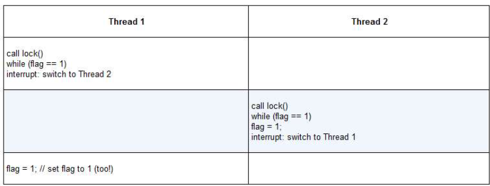

## 并发介绍
&ensp;&ensp;每个线程类似于独立的进程，只有一点区别：它们共享地址空间，从而能够访问相同的数据<br/>
&ensp;&ensp;每个线程都有一个程序计数器，用于记录程序从哪里获取指令。<br/>
&ensp;&ensp;对于进程，我们将状态保存到进程控制块（PCB），现在，我们需要一个或多个线程控制块，保存每个线程的状态，与进程相比，线程之间上下文切换有一点主要区别：地址空间保持不变。<br/>
&ensp;&ensp;
### 1.线程创建
&ensp;&ensp;程序见t0.c，执行后会发现结果是不确定的，线程的创建有点像进行函数调用。然而，并不是首先执行函数然后返回给调用者，而是为被调用的例程创建一个新的执行线程，它可以独立于调用者运行，可以在创建者返回之前运行，但也许会晚很多。
### 2.锁
&ensp;&ensp;并发的基本问题：希望原子式执行一系列指令，但由于单处理器的中断，这很难做到。<br/>
&ensp;&ensp;锁就是一个变量。这个锁变量保存了锁在某一时刻的状态，它要么是可用的，（available）表示没有线程持有锁，要么被占用的（acquired）表示有一个线程持有锁。<br/>
&ensp;&ensp;lock()和unlock()函数，调用lock（）尝试获取锁，如果没有其他线程持有锁，该线程会获得锁，进入临界区。一旦调用unlock（），锁就变成可用的了，如果没有其他等待线程。<br/>
&ensp;&ensp;锁提供了最小程度的调度控制。
#### Pthread锁
&ensp;&ensp;POSIX将锁称为互斥量（mutex），用来提供线程之间的互斥。
```c
pthread_mutex_t lock = PTHREAD_MUTEX_INITIALIZER
Pthread_mutex_loack(&lock);
balance = balance + 1;
Pthread_mutex_unlock(&lock)
```
&ensp;&ensp;不同于任何临界区都使用同一个大锁，通常大家会用不同的锁保护不同的数据和结构，从而允许更多的线程进入临界区.
#### 评价锁
&ensp;&ensp;如何评价锁的性能？一，锁是否能完成它的基本任务，即提供互斥。二，公平性（不会产生饿死或死锁）。三，性能
#### 控制中断
&ensp;&ensp;最开始的互斥解决方案就是在临界区关闭中断，优点是简单，容易理解，缺点就是允许所有调用线程执行特权操作（打开关闭中断），即信任这种机制不会被滥用。但是这种信任会带来许多麻烦。<br/>
&ensp;&ensp;**一**，一个程序可能在它开始就调用lock（），从而独占处理器。如果一个恶意程序一直调用lock，导致死循环，系统无法重写获取控制，只能重启系统。<br/>
&ensp;&ensp;**二**，不支持多处理器，如果多个线程运行在不同的CPU上，每个线程都试图进入同一个临界区，关闭中断也没用。<br/>
&ensp;&ensp;**三**，关闭中断导致中断丢失，可能会导致严重的系统问题，例如磁盘设备完成了读取请求，但CPU错失了这一事实，那么，os如何知道去唤醒等待读取的进程<br/>
&ensp;&ensp;**最后**一个就是效率低，关闭/打开中断的代码比执行正常指令速度要慢
#### 测试并设置指令（原子交换）
&ensp;&ensp;这是最简单的硬件支持，第一次尝试，想法：用一个变量来标志锁是否被线程占用。第一个线程进入临界区，调用lock（），检查标志是否为1，然后设置标志为1，表明线程持有该锁。结束临界区，线程调用unlock（），清除标志，表示锁未被持有。
```c
typedef struct lock_t { int flag; } lock_t;
void init(lock_t *mutex) {
//0 ->lock is available，1 ->heldmutex->flag= 0;
}
void lock(lock_t *mutex){
while (mutex->flag == 1)// TEST the flag
; // spin-wait (do nothing)
mutex->flag = 1;
//now SET it!
}
void unlock (lock_t *mutex) {
mutex->flag = 0;
}
```
&ensp;&ensp;遗憾的是，这段代码有两个问题：正确性和性能.

&ensp;&ensp;通过上图,可以发现两个线程同时将标志设置为1,都能进入临界区的场景.<br/>
&ensp;&ensp;性能问题主要是线程在等待已经被持有的锁时,采用了自选等待的技术,就是不停地检查标志地值.自旋等待在等待其他线程释放锁地时候会浪费时间,尤其在单处理器上.
#### 实现可用的自旋锁
&ensp;&ensp;一些系统提供硬件指令,来创建简单的锁,在SPARC上,这个指令叫Idstub(load/store unsigned byte,加载/保存无符号字节);在x86上,是xchg(atomic exchange,原子交换)指令.通常称为测试并设置指令
```c
int TestAndSet (int *old ptr,int new){
  int old = *old ptr; // fetch old value at old ptr*
  old_ptr = new; // store 'new’into old _ptr
  return old; // return the old value
}
```
&ensp;&ensp;上述代码为测试并设置指令,它返回old_ptr指向的旧值,同时更新为new的新值.<br/>
&ensp;&ensp;以下代码使用该指令实现的一个简单自旋锁
```c
typedef struct lock_t {
  int flag;
} lock_t;

void init(lock_t *lock) {
  // 没有其他线程持有锁
  lock->flag = 0;
}

void lock(lock_t *lock) {
  while(TestAndSet(&lock->flag, 1) == 1);
}

void unlock(lock_t *lock) {
  lock->flag = 0
}
```
&ensp;&ensp;解释一个为什么这个锁为什么能工作.首先假设一个线程在运行,调用lock(),flag=0表示没有其他线程持有锁.当调用TestAndSet(flag,1)方法,返回0,线程会跳出while循环,获取锁.同时也会原子的设置flag为1,标志锁已经被持有.当线程离开临界区时,调用unlock()将flag清理为0.
&ensp;&ensp;第二种场景也就是当一个线程想要获取锁时,如果当前有锁占有锁,那么testandset函数会一直返回1,导致本线程自旋.除非flag被设置为0.
#### 评价自旋锁
&ensp;&ensp;一,正确性,能够互斥且一次只允许一个线程进入临界区.<br/>
&ensp;&ensp;二,公平性,没有公平性,可能会导致饿死<br/>
&ensp;&ensp;三,性能,在单CPU情况下,开销较大,假设一个线程持有锁进入临界区被抢占,调度器可能会允许其他每一个线程,而其他线程都在竞争锁,都会放弃CPU之前,自旋一个时间片,浪费CPU周期.在多CPU上,性能不错.假设线程A在CPU 1，线程B在CPU 2竞争同一个锁。线程A（CPU 1）占有锁时，线程B竞争锁就会自旋（在CPU 2上）。然而，临界区一般都很短，因此很快锁就可用，然后线程B获得锁。自旋等待其他处理器上的锁，并没有浪费很多CPU周期，因此效果不错。
#### 比较并交换
&ensp;&ensp;一个硬件原语,以下是这条指令的C语言伪代码.
```c
int CompareAndSwap(int *ptr,int expected,int new){
  int actual = *ptr;
  if (actual == expected)
  *ptr = new;
  return actual;
}
```
&ensp;&ensp;这个指令的基本思路是检测ptr指向的值是否和expected相等;如果是,更新ptr所指的值为新值,否则,什么也不做.不论哪种情况,都会该内存地址的实际值.<br/>
&ensp;&ensp;可以用该指令实现一个锁
```c
void lock(lock_t *lock) {
  while (CompareAndSwap(&lock->flag, 0, 1) == 1);
}
```
&ensp;&ensp;与测试并设置的例子一样,检查标志是否为0,如果是,原子交换为1,从而获得锁.锁被持有时,竞争锁的线程会自旋.
#### 链接的加载和条件式存储指令(LL/SC)
&ensp;&ensp;以下是该硬件指令的C语言伪代码
```c
int LoadLinked(int *ptr) {
  return *ptr;
}
int StoreConditional(int *ptr, int value) {
  if (no one has update *ptr since the LoadLinked to this address) {
    *ptr = value;
    return 1; // success!
  } else {
    return 0; // failed
  }
}
```
&ensp;&ensp;链接的加载指令是从内存中取出值存入一个寄存器,条件式存储指令,只有上一次加载的地址在期间都没有更新时,才会成功.
&ensp;&ensp;用该指令实现一个lock()
```c
void lock(lock_t *lock) {
  while (1) {
    while (LocdLinked(&lock -> flag == 1));
    if (StoreConditional(&lock->flag, 1) == 1) 
      return;
  }
}
void unlock(lock_t *lock) {
  lock->flag = 0;
}
```
精简版lock
```c
void lock(lock_t *lock) {
  while (LoadLinked(&lock->flag) || !StoreConditional(&lock->flag, 1));
}
```
#### 获取并增加
&ensp;&ensp;最后一个硬件原语,它能原子地返回特定地址的旧值,并且让该值自增一.它的C语言伪代码如下:
```c
int FetchAndAdd(int *ptr) {
  int old = *ptr;
  *ptr = old + 1;
  return old;
}
```
&ensp;&ensp;可以用该原语实现一个更有趣的ticket锁.
```c
typedef struct lock_t {
  int ticket;
  int turn;
} lock_t;

void lock_init(lock_t *lock) {
  lock->ticket = 0;
  lock->turn=0;
}

void lock(lock_t *lock) {
  int myturn = FetchAndAdd(&lock->ticket);
  while(lock->turn != myturn);
}

void unlock(lock_t *lock) {
  FetchAndAdd(&lock->turn);
}
```
&ensp;&ensp;使用ticket和turn变量来构建锁,如果某个线程希望获取锁,则对ticket值执行一个原子的获取并加1操作,返回旧值,如果和该线程的turn.unolock则是增加turn,从而下一个等待线程可以进入临界区.<br/>
&ensp;&ensp;不同于之前的方法:本方法能保证所有线程都能抢到锁.只要一个线程获得ticket值,它最终会被调度.
#### 解决自旋占用太多时间片的问题
&ensp;&ensp;一种简单的方法就是,在要自旋的时候,放弃CPU.以下代码就展示了这种方法.
```c
void int() {
  flag = 0;
}
void lock() {
  while(TestAndSet(&flag, 1) == 1)
    yield();
}
void unlock() {
  flag = 0;
}
```
&ensp;&ensp;yield()系统调用能够让运行态变为就绪态,从而允许其他线程运行.让出线程本质上取消调度了自己.<br/>
&ensp;&ensp;这种方法使得线程在发现锁被抢占时,可以让出CPU,直到持有锁的线程再次运行.但是存在极大的上下文切换的成本.
#### 使用队列:休眠替代自旋
&ensp;&ensp;利用Solaris提供的支持,它提供了两个调用:park()能够让调用线程休眠,unpark(threadID)则会唤醒threadID标识的线程.可以用这两个调用来实现锁,让调用者在获取不到锁时睡眠,在所可用时被唤醒.
```c
typedef struct lock_t {
  int flag;
  int guard;
  queue_t *q;
} lock_t;

void lock_init(lock_t *m) {
  m->flag = 0;
  m->guard = 0;
  queue_init(m->q);
}

void lock(lock_t *m) {
  while (TestAndSet(&m->guard, 1) == 1);
  // acquire guard lock by spinning
  if (m->flag == 0) {
    // 当前线程获得锁
    m->flag = 1;
    m->guard = 0;
  } else {
    // 已有线程获得，将当前线程ID加入等待队列中，并休眠
    queue_add(m->q, gettid());
    m->guard = 0;
    park();
  }
}

void unlock(lock_t *m) {
  // 如果有线程正在尝试加锁，则要阻塞
  while(TestAndSet(&m->guard, 1) == 1);
  if (queue_empty(m->q))
    m->flag = 0; // 当前队列中没有线程想要获得锁，可以释放
  else 
    // 当前队列有线程想要获得锁，所以唤醒一个线程即可
    unpark(queue_remove(m->q));
  m->guard = 0;
}
```
&ensp;&ensp;guard起到了自旋锁的作用
### 3.基于锁的并发数据结构
#### 并发计数器
```c
typedef struct counter_t {
  int value;
  pthread_mutex_t lock;
} counter_t;

void init(counter_t *c) {
  c->value = 0;
  Pthread_mutex_init(&c->lock, NULL);
}

void increment(counter_t *c) {
  Pthread_mutex_lock(&c->lock);
  c->value ++;
  Pthread_mutex_unlock(&c->lock);
}

void decrement(counter_t *c) {
  Pthread_mutex_lock(&c->lock);
  c->value --;
  Pthread_mutex_unlock(&c->lock);  
}

int get(counter_t *c) {
  Pthread_mutex_lock(&c->lock);
  int rc = c->value;
  Pthread_mutex_unlock(&c->lock);  
  return rc;
}
```
&ensp;&ensp;这是一个简单的并发计数器，但这个结构导致运行速度太慢。<br/>
**可扩展的计数-懒惰计数器**
&ensp;&ensp;懒惰计数器通过多个局部计数器和一个全局计数器来实现一个逻辑计数器。<br/>
&ensp;&ensp;它的基本思想：如果一个核心上的线程想增加计数器，那就增加它的局部计数器，访问这个局部计数器是通过对应的局部锁同步的。每个CPU都有自己的局部计数器，不同CPU上的线程不会竞争，所以计数器的更新操作可扩展性好。<br/>
&ensp;&ensp;为了保证全局计数器更新，局部值会定期转移给全局计数器，方法是获取全局锁，让全局计数器加上局部计数器的值，然后将局部计数器置零。
```c
typedef struct counter_t {
  int global;
  pthread_mutex_t glock;
  int local[NUMCPUS];
  pthread_mutex_t llock[NUMCPUS];
  int threshold; // 局部转全局的频度
} counter_t;

void init(counter_t *c, int threshold) {
  c->threshold = threshold;

  c->global = 0;
  pthread_mutex_init(&c->glock, NULL);
  int i;
  for (i = 0; i < NUMCPUS; i ++) {
    c->local[i] = 0;
    pthread_mutex_init(&c->llock[i], NULL);
  }
}

void update(counter_t *c, int threadID, int amt) {
  pthread_mutex_lock(&c->llock[threadID]);
  c->local[threadID] += amt;
  if (c->local[threadID] >= c->threshold) {
    pthread_mutex_lock(&c->glock);
    c->global += c->local[threaID];
    pthread_mutex_unlock(&c->glock);
    c->local[threadID] = 0;
  }
  pthread_mutex_unlock(&c->llock[threadID]);
}

int get(counter_t *c) {
  pthread_mutex_locak(&c->glock);
  int val = c->global;
  pthread_mutex_unlock(&c->glock);
  return val;
}
```
#### 并发链表
&ensp;&ensp;下面是C伪代码
```c
typedef struct node_t {
  int key;
  struct node_t *next;
} node_t;

typedef struct list_t {
  node_t *head;
  pthread_mutex_t lock;
} list_t;

void List_Init(list_t *L) {
  L->head = NULL;
  pthread_mutex_init(&L->lock, NULL);
}

int List_Insert(list_t *L, int key) {
  pthread_mutex_lock(&L->lock);
  node_t *new = malloc(sizeof(node_t));
  if (new == NULL) {
    perror("malloc");
    pthread_mutex_unlock(&L->lock);
    return -1;
  }
  new->key = key;
  new->next = L->head;
  L->head = new;
  pthread_mutex_unlock(&L->lock);
  return 0;
}

int List_LookUp(list_t *L, int key) {
  pthread_mutex_lock(&L->lock);
  node_t *curr = L->head;
  while (curr) {
    if (curr->key == key) {
      pthread_mutex_unlock(&L->lock);
      return 0;
    }
    curr = curr->next;
  }
  pthread_mutex_unlock(&L->lock);
  return -1;
}
```
&ensp;&ensp;还有一种扩展链表，增加了一个过手锁，每个节点都有一个锁，替代之前整个链表一个锁，遍历链表的时候，首先抢占下一个节点的锁，然后释放当前节点的锁。但是开销大。
#### 并发队列
```c
typedef struct node_t {
  int value;
  struct node_t *next;
} node_t;

typedef struct queue_t {
  node_t *head;
  node_t *tail;
  pthread_mutex_t headLock;
  pthread_mutex_t tailLock;
} queue_t;

void Queue_Init(queue_t *q) {
  node_t *tmp = malloc(sizeof(node_t));
  tmp->next = NULL;
  q->head = q->tail = tmp;
  pthread_mutex_init(&q->headLock, NULL);
  pthread_mutex_init(&q->tailLock, NULL);
}

void Queue_Enqueue(queue_t *q, int value) {
  node_t *tmp = malloc(sizeof(node_t));
  assert(tmp != NULL);
  tmp->value = value;
  tmp->next=NULL;

  pthread_mutex_lock(&q->tailLock);
  q->tail->next = tmp;
  q->tail = tmp;
  pthread_mutex_unlock(&q->tailLock);
}

int Queue_Dequeue(queue_t *q, int *value) {
  pthread_mutex_lock(&q->headLock);
  node_t *tmp = q->head;
  node_t *newHead = tmp->next;
  if (newHead == NULL) {
    pthread_mutex_unlock(&q->headLock);
    return -1;
  }
  *value = newHead->value;
  q->head = newHead;
  pthread_mutex_unlock(&q->headLock);
  free(tmp);
  return 0;
}
```
#### 并发散列表
```c
#define BUCKETS(101)

typedef struct hash_t {
  list_t lists[BUCKETS];
} hash_t;

void Hash_Init(hash_t *H) {
  int i;
  for (i = 0; i < BUCKETS; i ++) {
    List_Init(&H->lists[i]);
  }
}

int Hash_Insert(hash_t *H, int key) {
  int bucket = key % BUCKETS;
  return List_Insert(&H->lists[bucket], key);
}

int Hash_Lookup(hash_t *H, int key) {
  int bucket = key % BUCKETS;
  return List_Lookup(&H->lists[bucket], key);
}
```
### 4. 条件变量
&ensp;&ensp;很多时候，线程需要检查某一条件满足之后，才会继续运行。例如，父线程需要检查子线程是否执行完毕，这常被称为`join()`。虽然可以通过让主线自旋检查来解决，但会浪费CPU时间。
#### 定义和程序
&ensp;&ensp;条件变量是一个显示队列，当某些执行状态不满足时，线程可以把自己加入队列，等待（waiting）该条件。另外某个线程，当它改变了上述状态时，就可以唤醒一个或者多个等待线程，让它们继续执行。
&ensp;&ensp;条件变量有两种相关操作：wait（）和signal（），前者是睡眠，后者是唤醒。<br/>
&ensp;&ensp;使用该方法实现父线程等线程代码见`t2.c`
#### 生产者/消费者（有界缓冲区）问题
&ensp;&ensp;问题描述：假设有一个或多个生产者线程和一个或多个消费者线程。生产者把生产的数据放入缓冲区；消费者从缓冲区取走数据项，以某种方式消费。<br/>
&ensp;&ensp;因为有界缓冲区是共享资源，所以必须通过同步机制来访问它，以免产生竞态条件。<br/>
&ensp;&ensp;首先定义下面两个函数
```c
int buffer;
int count = 0;

void put(int value) {
  assert(count == 0);
  count = 1;
  buffer = value;
} 

int get() {
  assert(count == 1);
  count = 0;
  return buffer;
}
```
&ensp;&ensp;put函数假设缓存区是空的，把一个值存在缓冲区，把count设置为1表示缓冲区满了，get相反。<br/>
&ensp;&ensp;原书先说了一些反例，再通过步步优化得出最终的生产者消费者方案，此处给出最优代码，再一一解释
```c
cond_t empty, fill;
mutex_t mutex;

void *producer(void *arg) {
  int i;
  for (i = 0; i < loops; i ++) {
    Pthread_mutex_lock(&mutex);
    while(count == 1)
      Pthread_cond_wait(&empty, &mutex);
    put(i);
    Pthread_cond_signal(&fill);
    Pthread_mutex_unlock(&mutex);
  }
}

void *consumer(void *arg) {
  int i;
  for (i = 0; i < loops; i ++) {
    Pthead_mutex_lock(&mutex);
    while(count == 0)
      Pthead_cond_wait(&fill, &mutex);
    int tmp = get();
    Pthread_cond_signal(&empty);
    Pthread_mutex_unlock(&mutex);
    printf("%d\n", tmp);
  }
}
```
&ensp;&ensp;考虑第一个事，使用while而不用if，考虑当消费者1被唤醒（在wait返回之前）进行消费正准备进行消费时，消费者2突然插进来，消费掉了，此时消费者1再调用get，将会导致断言触发，代码无法像预期那样工作。使用while替代if，可以在消费者1被唤醒后，立即再次检查共享变量，如果缓存区为空，则继续睡眠。<br/>
&ensp;&ensp;第二个事，唤醒对象的指向性问题。考虑如果消费者1消费完后，唤醒一个在睡眠的线程，如果此时唤醒的是消费者2，那么它会发现缓冲区为空，就继续休眠，那么就会发现全都在休眠。<br/>解决方法就是设置两个条件变量`empty`,发信号给变量`fill`.相应地，消费者线程等待`fill`,发信号给`empty`.


