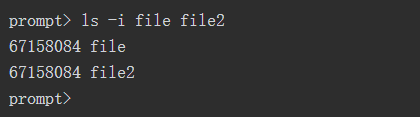
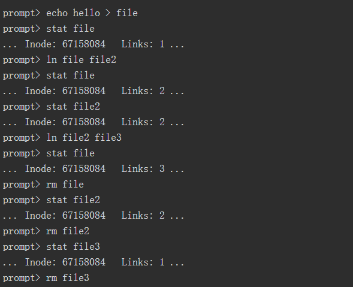
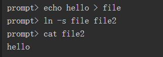
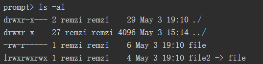
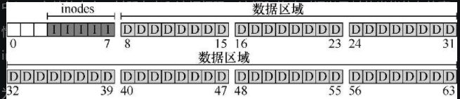
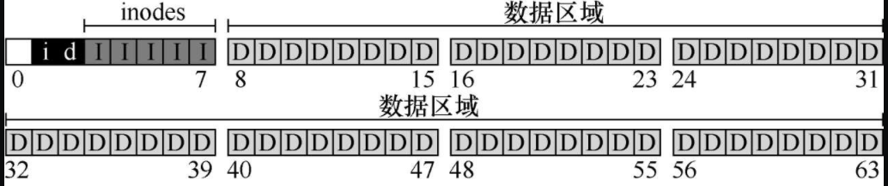
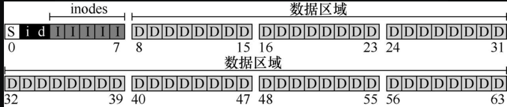
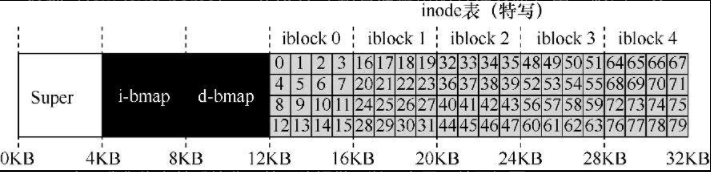
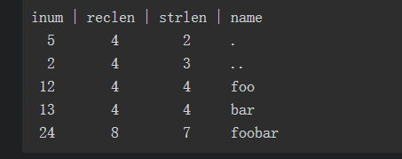

# 持久性

## 1. IO设备

### 1. 1 系统架构图


### 1.2利用中断减少CPU开销

​	有了中断后，CPU 不再需要不断轮询设备，而是向设备发出一个请求，然后就可以让对应进程睡眠，切换执行其他任务。当设备完成了自身操作，会抛出一个硬件中断，引发CPU跳转执行操作系统预先定义好的中断服务例程

​	不一定什么场景使用中断都是最佳方案：

- 假如有一个非常高性能的设备，它处理请求很快：通常在CPU第一次轮询时就可以返回结果。此时如果使用中断，反而会使系统变慢
- 另一个最好不要使用中断的场景是网络。网络端收到大量数据包，如果每一个包都发生一次中断，那么有可能导致操作系统发生活锁（live-lock），即不断处理中断而无法处理用户层的请求

### 1.3	利用DMA进行更高效的数据传送

​	`DMA`引擎是系统中的一个特殊设备，它可以协调完成内存和设备间的数据传递，不需要CPU介入。

​	DMA工作过程如下。==为了能够将数据传送给设备，操作系统会通过编程告诉DMA引擎数据在内存的位置，要拷贝的大小以及要拷贝到哪个设备。在此之后，操作系统就可以处理其他请求了。当DMA的任务完成后，DMA控制器会抛出一个中断来告诉操作系统自己已经完成数据传输。==


### 1.4 设备交互的方法

1. 用明确的I/O指令

​		使用特权指令

2. 内存映射I/O

    ​	通过这种方式，硬件将设备寄存器作为内存地址提供。当需要访问设备寄存器时，操作系统装载（读取）或者存入（写入）到该内存地址；然后硬件会将装载/存入转移到设备上，而不是物

### 1.5 设备驱动程序

​	每个设备都有非常具体的接口，需要将它们纳入操作系统，所以需要操作系统尽可能通用。操作系统代码大多数都是驱动代码

## 2. 磁盘驱动器

###  2.1 接口

​	所有现代驱动器的基本接口都很简单。驱动器由大量`扇区`（512字节块）组成，每个扇区都可以读取或写入。在具有n个扇区的磁盘上，扇区从0到n−1编号。因此，我们可以将磁盘视为一组扇区，0到n−1是驱动器的地址空间（address space）。

### 2.2 基本几何形状

​	磁盘可能有一个或多个盘片。每个盘片有两面，每面都称为表面。这些盘片通常由一些硬质材料（如铝）制成，然后涂上薄薄的磁性层，即使驱动器断电，驱动器也能持久存储数据位。

​	所有盘片都围绕主轴（spindle）连接在一起，主轴连接到一个电机，以一个恒定（固定）的速度旋转盘片（当驱动器接通电源时）。

​	数据在扇区的同心圆中的每个表面上被编码。我们称这样的同心圆为一个磁道（track）。一个表面包含数以千计的磁道，紧密地排在一起，数百个磁道只有头发的宽度。


### 2.3 简单磁盘驱动器


​	等待期望的扇区旋转到磁头下所需的时间称为==旋转延迟==

​	**多磁道会产生寻道时间**


​	寻道有许多阶段：首先是磁盘臂移动时的加速阶段。然后随着磁盘臂全速移动而惯性滑动。然后随着磁盘臂减速而减速。最后，在磁头小心地放置在正确的磁道上时停下来。

​	当扇区11经过磁盘磁头时，I/O的最后阶段将发生，称为传输

​	所以整个流程是：==寻道-等待转动延迟-传输==

> 细节：
>
> 1. 扇区往往会偏斜，因为从一个磁道切换到另一个磁道时，磁盘需要时间来重新定位磁头
> 2. 外圈磁道通常比内圈磁道具有更多扇区
> 3. 任何现代磁盘驱动器都有一个重要组成部分，即它的缓存

### 2.4 IO时间

$T_{I/O} = T_{寻道} + T_{旋转} + T_{传输}$

### 2.5 磁盘调度

**SSTF：最短寻道时间优先**

问题：

1. 主机操作系统无法利用驱动器的几何结构，而是只会看到一系列的块。（可以解决，操作系统可以简单地实现最近块优先）
2. 饥饿

**电梯（又称SCAN或C-SCAN）**

**SPTF：最短定位时间优先**

## 3. 廉价冗余磁盘阵列（RAID）

​	从外部看，RAID看起来像一个磁盘：一组可以读取或写入的块。在内部，RAID是一个复杂的庞然大物，由多个磁盘、内存（包括易失性和非易失性）以及一个或多个处理器来管理系统。

​	与单个磁盘相比，RAID具有许多优点。一个好处就是性能。并行使用多个磁盘可以大大加快I/O时间。另一个好处是容量。大型数据集需要大型磁盘。最后，RAID可以提高可靠性。

### 3.1 接口和RAID内部

​	当文件系统向RAID发出逻辑I/O请求时，RAID内部必须计算要访问的磁盘（或多个磁盘）以完成请求，然后发出一个或多个物理I/O来执行此操作。

###  3.2 故障模型

​	磁盘可以处于两种状态之一：工作状态或故障状态。

​	故障—停止模型的一个关键方面是它关于故障检测的假定。具体来说，当磁盘发生故障时，我们认为这很容易检测到。

### 3.3 如何评估RAID

 	1. 容量
 	2. 可靠性
 	3. 性能

（这部分好难。。。回头再看）

## 4. 插叙：文件和目录

> 进程，它是虚拟化的CPU；地址空间，它是虚拟化的内存

### 4.1 文件和目录

​	文件（file）。文件就是一个线性字节数组，每个字节都可以读取或写入。每个文件都有某种低级名称（low-level name），通常是某种数字（通常称为inode号）。

​	目录（directory）。一个目录，像一个文件一样，也有一个低级名字（即inode号），但是它的内容非常具体：它包含一个（用户可读名字，低级名字）对的列表。

​	目录层次结构从根目录（root directory）开始（在基于UNIX的系统中，根目录就记为“/”），并使用某种分隔符（separator）来命名后续子目录（sub-directories），直到命名所需的文件或目录。


### 4.2 创建文件

​	创建一个文件。这可以通过open系统调用完成。通过调用open()并传入`O_CREAT`标志，程序可以创建一个新文件。

```c
int fd = open("foo", O_CREAT | O_WRONLY | O_TRUNC);
```

​	在本例中，程序创建文件（`O_CREAT`），只能写入该文件，因为以（`O_WRONLY`）这种方式打开，并且如果该文件已经存在，则首先将其截断为零字节大小，删除所有现有内容（`O_TRUNC`）。

​	`open()`的一个重要方面是它的返回值：文件描述符（file descriptor）。文件描述符只是一个整数，是每个进程私有的。

### 4.3 读写文件

​	使用`strace`命令查看`cat`是如何访问文件的


### 4.4 读取和写入，但不按顺序

​	使用`lseek`()系统调用从文件中的某些随机偏移量中读取数据

```c
off_t lseek(int fildes, off_t offset, int whence);
```

​	第一个参数是熟悉的（一个文件描述符）。第二个参数是偏移量，它将文件偏移量定位到文件中的特定位置。第三个参数，由于历史原因而被称为whence，明确地指定了搜索的执行方式。

​	调用`lseek()`与移动磁盘臂的磁盘的寻道（seek）操作无关。对`lseek()`的调用只是改变内核中变量的值。(更改指针指向)

### 4.5 用fsync()立即写入

​	当程序调用write()时，它只是告诉文件系统：请在将来的某个时刻，将此数据写入持久存储。出于性能的原因，文件系统会将这些写入在内存中缓冲（buffer）一段时间（例如5s或30s）。在稍后的时间点，写入将实际发送到存储设备。从调用应用程序的角度来看，写入似乎很快完成，并且只有在极少数情况下（例如，在write()调用之后但写入磁盘之前，机器崩溃）数据会丢失。

​	但有些时候这种可能会造成很大的威胁，需要一些控制`api`立即写入数据

​	在UNIX中，提供给应用程序的接口被称为`fsync(int fd)`。当进程针对特定文件描述符调用`fsync()`时，文件系统通过强制将所有脏（dirty）数据（即尚未写入的）写入磁盘来响应，针对指定文件描述符引用的文件。

### 4.6 文件重命名

​	`mv`使用了系统调用rename(char * old, char * new)，它只需要两个参数：文件的原来名称（old）和新名称（new）。

### 4.7 获取文件信息

​	stat file

### 4.8 删除文件

​	unlink()只需要待删除文件的名称，并在成功时返回零

### 4.9 硬链接

​	所谓的link()系统调用。link()系统调用有两个参数：一个旧路径名和一个新路径名。当你将一个新的文件名“链接”到一个旧的文件名时，你实际上创建了另一种引用同一个文件的方法。(相当于两个指针)

​	link只是在要创建链接的目录中创建了另一个名称，并将其指向原有文件的相同inode号（即低级别名称）。该文件不以任何方式复制。相反，你现在就有了两个人类可读的名称（file和file2），都指向同一个文件。



​	首先，要构建一个结构（inode），它将跟踪几乎所有关于文件的信息，包括其大小、文件块在磁盘上的位置等等。其次，将人类可读的名称链接到该文件，并将该链接放入目录中。这也是为什么我们使用ulink从文件系统中删除一个文件的原因。

​	当删除或增加一个文件时，它的引用计数会随之改变

​	

### 4.10 符号链接(软链接)

​	硬链接有点局限：不能创建目录的硬链接（因为担心会在目录树中创建一个环），不能硬链接到其他磁盘分区中的文件。

​	

​	但是，除了表面相似之外，符号链接实际上与硬链接完全不同。第一个区别是符号链接本身实际上是一个不同类型的文件。

​	形成符号链接的方式，即将链接指向文件的路径名作为链接文件的数据。



​	由于创建符号链接的方式，有可能造成所谓的悬空引用

​	==符号链接与硬链接完全不同，删除名为file的原始文件会导致符号链接指向不再存在的路径名。==

### 4.11 创建并挂载文件系统

​	mount的作用很简单：以现有目录作为目标挂载点（mount point），本质上是将新的文件系统粘贴到目录树的这个点上。

## 5. 文件系统实现

​	文件系统是纯软件。与CPU和内存虚拟化的开发不同，我们`不会添加硬件功能`来使文件系统的某些方面更好地工作（但我们需要注意设备特性，以确保文件系统运行良好）。

### 5.1 思考方式

​	注重考虑==文件系统的数据结构==和==访问方法==。

### 5.2 整体组织

​	磁盘是分块的，每块的大小通常为`4KB`.

​	块中存储大多数是用户数据，存储用户数据的区域称为数据区域

​	有个`inode`的结构用于记录诸如`文件包含哪些数据块`（在数据区域中）、`文件的大小`，`其所有者`和`访问权限`、`访问和修改时间`以及其他类似信息的事情

​	为了存放inode，需要在磁盘上留出些空间，将这部分称为`inode`表，保存了一个磁盘上`inode`的数组



​	通常，inode只有128或256字节。

​	假设每个inode有256字节，一个4kb块则可以容纳16个inode，对于上图，则需要80个inode，也就是5个块

​	需要使用一个空闲列表（`free list`）指向第一个空闲块。所以选择一种简单而流行的结构，称为位图（bitmap），一种用于数据区域（数据位图，databitmap），另一种用于inode表（inode位图，inode bitmap）



​	4kb位图可以记录32kb对象是否分配

​	超级块（superblock），在下图中用S表示。超级块包含关于该特定文件系统的信息，包括例如文件系统中有多少个inode和数据块（在这个例子中分别为80和56）、inode表的开始位置（块3）等等



### 5.3 文件组织：inode

​	inode 是 index node的缩写，译为索引节点

​	在VSFS中，假设，获取VSFS的inode表：大小为20KB（5个4KB块），因此由80个inode（假设每个inode为256字节）组成。进一步假设inode区域从12KB开始（即超级块从0KB开始，inode位图在4KB地址，数据位图在8KB，因此inode表紧随其后）。

​	

​	要读取inode号32，文件系统首先会计算inode区域的偏移量（32×inode的大小，即8192），将它加上磁盘inode表的起始地址（inodeStartAddr = 12KB），从而得到希望的inode块的正确字节地址：20KB。

​	在每个inode中，实际上是所有关于文件的信息：`文件类型`（例如，常规文件、目录等）、`大小`、`分配给它的块数`、`保护信息`（如谁拥有该文件以及谁可以访问它）、`一些时间信息`（包括文件创建、修改或上次访问的时间文件下），以及`有关其数据块驻留在磁盘上的位置的信息`（如某种类型的指针）。我们将所有关于文件的信息称为元数据（metadata）。

### 5.4 多级索引

​	感觉这一部分书上没说明白。。。不就是直接索引，一级索引。。。

### 5.5 目录结构

​	

​	每个条目都有一个inode号，记录长度（名称的总字节数加上所有的剩余空间），字符串长度（名称的实际长度），最后是条目的名称。请注意，每个目录有两个额外的条目：.（点）和..（点点）。

### 5.6 访问路径：读取和写入

​	**从磁盘中读取文件**.

​	`open("/foo/bar", O_RDONLY)`，

​	首先需要找到文件bar的inode，从而获取关于该文件的一些基本信息（权限信息、文件大小等等）。为此，文件系统必须能够找到inode，但它现在只有完整的路径名。文件系统必须遍历（traverse）路径名，从而找到所需的inode。

​	首先要先找到根目录的inode，对于文件系统来说，根的inode节点号是公开的，为2

​	一旦inode被读入，文件系统可以在其中查找指向数据块的指针，数据块包含根目录的内容。因此，文件系统将使用这些磁盘上的指针来读取目录，在上述例子中，寻找`foo`的条目。通过读入一个或多个目录数据块，它将找到`foo`的条目，一旦找到，文件系统也会找到下一个需要的foo的inode号

​	下一步是递归遍历路径名，直到找到所需的inode。最后找到bar的inode号。open()的最后一步是将bar的inode读入内存。然后文件系统进行最后的权限检查，在每个进程的打开文件表中，为此进程分配一个文件描述符，并将它返回给用户。

> ​	补充：读取不会访问分配结构我们曾见过许多学生对分配结构（如位图）感到困惑。特别是，许多人经常认为，只是简单地读取文件而不分配任何新块时，也会查询位图。不是这样的！分配结构（如位图）只有在需要分配时才会访问。inode、目录和间接块具有完成读请求所需的所有信息。inode已经指向一个块，不需要再次确认它已分配。

​	**写入磁盘**

​	写入文件是一个类似的过程。首先，文件必须打开（如上所述）。其次，应用程序可以发出write()调用以用新内容更新文件。最后，关闭该文件。

​	写入文件在逻辑上会导致`5个I/O`：一个读取数据位图（然后更新以标记新分配的块被使用），一个写入位图（将它的新状态存入磁盘），再是两次读取，然后写入inode（用新块的位置更新），最后一次写入真正的数据块本身。

​	I/O工作总量非常大：一个读取inode位图（查找空闲inode），一个写入inode位图（将其标记为已分配），一个写入新的inode本身（初始化它），一个写入目录的数据（将文件的高级名称链接到它的inode号），以及一个读写目录inode以便更新它。如果目录需要增长以容纳新条目，则还需要额外的I/O（即数据位图和新目录块）。

### 5.7 缓存和缓冲

​	使用系统内存（DRAM）来缓存重要的块。

​	读缓存，可以避免更多的IO

​	但写缓存则不行，写入流量必须进入磁盘，才能实现持久。虽然如此，写缓冲肯定有许多优点。首先，通过延迟写入，文件系统可以将一些更新编成一批（batch），放入一组较小的I/O中。例如，如果在创建一个文件时，inode位图被更新，稍后在创建另一个文件时又被更新，则文件系统会在第一次更新后延迟写入，从而节省一次I/O。

## 6. 崩溃一致性：FSCK和日志

​	文件系统面临的一个主要挑战在于，如何在出现断电（power loss）或系统崩溃（system crash）的情况下，更新持久数据结构。

​	向文件追加内容时，要向它添加一个新数据块，因此必须更新3个磁盘上的结构：`inode`（必须指向新块，并且由于追加而具有更大的大小），`新数据块Db`和`新版本的数据位图`（称之为B[v2]）表示新数据块已被分配。

​	对于这三种更新操作，缺少哪个都不行，需要保证它们是原子性操作，但很难做到

### 解决方案1：文件系统检查程序

​	使用fcsk，他会在文件系统挂载并可用之前运行，它会检查超级块，空闲块，inode状态，inode链接，重复指针，坏块等

​	显然，这种方案很浪费

### 解决方案2：日志

​	基本思路如下。更新磁盘时，在覆写结构之前，首先写下一点小注记（在磁盘上的其他地方，在一个众所周知的位置），描述你将要做的事情。

​	通过将注释写入磁盘，可以保证在更新（覆写）正在更新的结构期间发生崩溃时，能够返回并查看你所做的注记，然后重试。因此，你会在崩溃后准确知道要修复的内容（以及如何修复它），而不必扫描整个磁盘。

​	