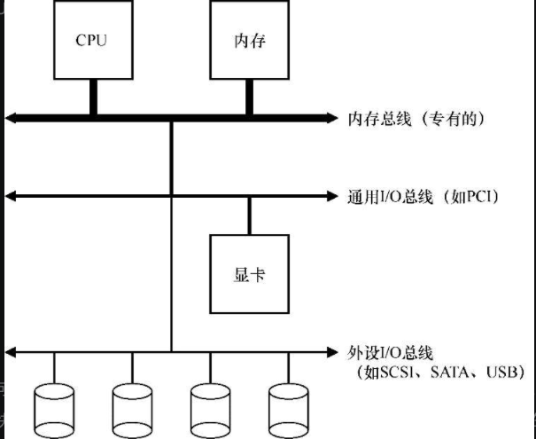
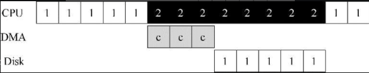
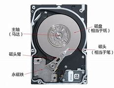
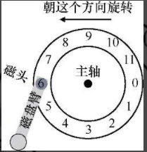
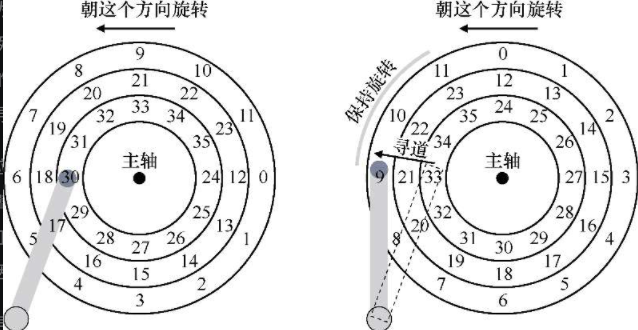
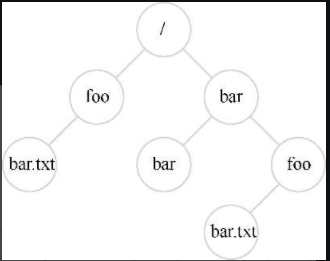
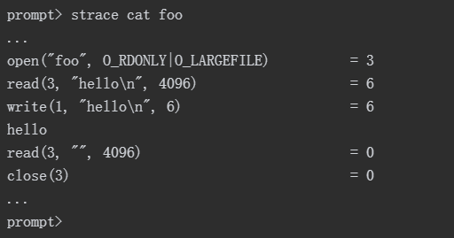

# 持久性

## 1. IO设备

### 1. 1 系统架构图



### 1.2利用中断减少CPU开销

​	有了中断后，CPU 不再需要不断轮询设备，而是向设备发出一个请求，然后就可以让对应进程睡眠，切换执行其他任务。当设备完成了自身操作，会抛出一个硬件中断，引发CPU跳转执行操作系统预先定义好的中断服务例程

​	不一定什么场景使用中断都是最佳方案：

- 假如有一个非常高性能的设备，它处理请求很快：通常在CPU第一次轮询时就可以返回结果。此时如果使用中断，反而会使系统变慢
- 另一个最好不要使用中断的场景是网络。网络端收到大量数据包，如果每一个包都发生一次中断，那么有可能导致操作系统发生活锁（live-lock），即不断处理中断而无法处理用户层的请求

### 1.3	利用DMA进行更高效的数据传送

​	`DMA`引擎是系统中的一个特殊设备，它可以协调完成内存和设备间的数据传递，不需要CPU介入。

​	DMA工作过程如下。==为了能够将数据传送给设备，操作系统会通过编程告诉DMA引擎数据在内存的位置，要拷贝的大小以及要拷贝到哪个设备。在此之后，操作系统就可以处理其他请求了。当DMA的任务完成后，DMA控制器会抛出一个中断来告诉操作系统自己已经完成数据传输。==



### 1.4 设备交互的方法

1. 用明确的I/O指令

​		使用特权指令

2. 内存映射I/O

    ​	通过这种方式，硬件将设备寄存器作为内存地址提供。当需要访问设备寄存器时，操作系统装载（读取）或者存入（写入）到该内存地址；然后硬件会将装载/存入转移到设备上，而不是物

### 1.5 设备驱动程序

​	每个设备都有非常具体的接口，需要将它们纳入操作系统，所以需要操作系统尽可能通用。操作系统代码大多数都是驱动代码

## 2. 磁盘驱动器

###  2.1 接口

​	所有现代驱动器的基本接口都很简单。驱动器由大量`扇区`（512字节块）组成，每个扇区都可以读取或写入。在具有n个扇区的磁盘上，扇区从0到n−1编号。因此，我们可以将磁盘视为一组扇区，0到n−1是驱动器的地址空间（address space）。

### 2.2 基本几何形状

​	磁盘可能有一个或多个盘片。每个盘片有两面，每面都称为表面。这些盘片通常由一些硬质材料（如铝）制成，然后涂上薄薄的磁性层，即使驱动器断电，驱动器也能持久存储数据位。

​	所有盘片都围绕主轴（spindle）连接在一起，主轴连接到一个电机，以一个恒定（固定）的速度旋转盘片（当驱动器接通电源时）。

​	数据在扇区的同心圆中的每个表面上被编码。我们称这样的同心圆为一个磁道（track）。一个表面包含数以千计的磁道，紧密地排在一起，数百个磁道只有头发的宽度。



### 2.3 简单磁盘驱动器



​	等待期望的扇区旋转到磁头下所需的时间称为==旋转延迟==

​	**多磁道会产生寻道时间**



​	寻道有许多阶段：首先是磁盘臂移动时的加速阶段。然后随着磁盘臂全速移动而惯性滑动。然后随着磁盘臂减速而减速。最后，在磁头小心地放置在正确的磁道上时停下来。

​	当扇区11经过磁盘磁头时，I/O的最后阶段将发生，称为传输

​	所以整个流程是：==寻道-等待转动延迟-传输==

> 细节：
>
> 1. 扇区往往会偏斜，因为从一个磁道切换到另一个磁道时，磁盘需要时间来重新定位磁头
> 2. 外圈磁道通常比内圈磁道具有更多扇区
> 3. 任何现代磁盘驱动器都有一个重要组成部分，即它的缓存

### 2.4 IO时间

$T_{I/O} = T_{寻道} + T_{旋转} + T_{传输}$

### 2.5 磁盘调度

**SSTF：最短寻道时间优先**

问题：

1. 主机操作系统无法利用驱动器的几何结构，而是只会看到一系列的块。（可以解决，操作系统可以简单地实现最近块优先）
2. 饥饿

**电梯（又称SCAN或C-SCAN）**

**SPTF：最短定位时间优先**

## 3. 廉价冗余磁盘阵列（RAID）

​	从外部看，RAID看起来像一个磁盘：一组可以读取或写入的块。在内部，RAID是一个复杂的庞然大物，由多个磁盘、内存（包括易失性和非易失性）以及一个或多个处理器来管理系统。

​	与单个磁盘相比，RAID具有许多优点。一个好处就是性能。并行使用多个磁盘可以大大加快I/O时间。另一个好处是容量。大型数据集需要大型磁盘。最后，RAID可以提高可靠性。

### 3.1 接口和RAID内部

​	当文件系统向RAID发出逻辑I/O请求时，RAID内部必须计算要访问的磁盘（或多个磁盘）以完成请求，然后发出一个或多个物理I/O来执行此操作。

###  3.2 故障模型

​	磁盘可以处于两种状态之一：工作状态或故障状态。

​	故障—停止模型的一个关键方面是它关于故障检测的假定。具体来说，当磁盘发生故障时，我们认为这很容易检测到。

### 3.3 如何评估RAID

 	1. 容量
 	2. 可靠性
 	3. 性能

（这部分好难。。。回头再看）

## 4. 插叙：文件和目录

> 进程，它是虚拟化的CPU；地址空间，它是虚拟化的内存

### 4.1 文件和目录

​	文件（file）。文件就是一个线性字节数组，每个字节都可以读取或写入。每个文件都有某种低级名称（low-level name），通常是某种数字（通常称为inode号）。

​	目录（directory）。一个目录，像一个文件一样，也有一个低级名字（即inode号），但是它的内容非常具体：它包含一个（用户可读名字，低级名字）对的列表。

​	目录层次结构从根目录（root directory）开始（在基于UNIX的系统中，根目录就记为“/”），并使用某种分隔符（separator）来命名后续子目录（sub-directories），直到命名所需的文件或目录。



### 4.2 创建文件

​	创建一个文件。这可以通过open系统调用完成。通过调用open()并传入`O_CREAT`标志，程序可以创建一个新文件。

```c
int fd = open("foo", O_CREAT | O_WRONLY | O_TRUNC);
```

​	在本例中，程序创建文件（`O_CREAT`），只能写入该文件，因为以（`O_WRONLY`）这种方式打开，并且如果该文件已经存在，则首先将其截断为零字节大小，删除所有现有内容（`O_TRUNC`）。

​	`open()`的一个重要方面是它的返回值：文件描述符（file descriptor）。文件描述符只是一个整数，是每个进程私有的。

### 4.3 读写文件

​	使用`strace`命令查看`cat`是如何访问文件的



### 4.4 读取和写入，但不按顺序

​	使用`lseek`()系统调用从文件中的某些随机偏移量中读取数据

```c
off_t lseek(int fildes, off_t offset, int whence);
```

​	第一个参数是熟悉的（一个文件描述符）。第二个参数是偏移量，它将文件偏移量定位到文件中的特定位置。第三个参数，由于历史原因而被称为whence，明确地指定了搜索的执行方式。

​	调用`lseek()`与移动磁盘臂的磁盘的寻道（seek）操作无关。对`lseek()`的调用只是改变内核中变量的值。(更改指针指向)

### 4.5 用fsync()立即写入

​	当程序调用write()时，它只是告诉文件系统：请在将来的某个时刻，将此数据写入持久存储。出于性能的原因，文件系统会将这些写入在内存中缓冲（buffer）一段时间（例如5s或30s）。在稍后的时间点，写入将实际发送到存储设备。从调用应用程序的角度来看，写入似乎很快完成，并且只有在极少数情况下（例如，在write()调用之后但写入磁盘之前，机器崩溃）数据会丢失。

​	但有些时候这种可能会造成很大的威胁，需要一些控制`api`立即写入数据

​	在UNIX中，提供给应用程序的接口被称为`fsync(int fd)`。当进程针对特定文件描述符调用`fsync()`时，文件系统通过强制将所有脏（dirty）数据（即尚未写入的）写入磁盘来响应，针对指定文件描述符引用的文件。

### 4.6 文件重命名

​	`mv`使用了系统调用rename(char * old, char * new)，它只需要两个参数：文件的原来名称（old）和新名称（new）。

### 4.7 获取文件信息

​	stat file

### 4.8 删除文件

​	unlink()只需要待删除文件的名称，并在成功时返回零

