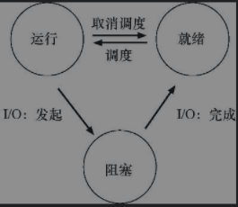
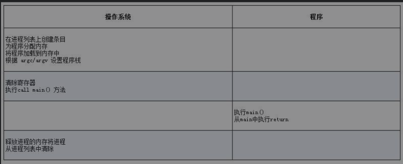
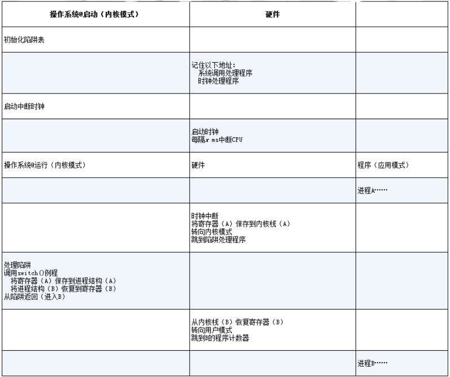

## 虚拟化
### 1. 抽象：进程
&ensp;&ensp;进程的非正式定义非常简单：进程就是运行中的程序。程序本身是没有生命周期的，它只是存在磁盘上面的一些指令（也可能是一些静态数据）。是操作系统让这些字节运行起来，让程序发挥作用。 
&ensp;&ensp;进程API有`创建，销毁，等待，查看状态`
#### 进程创建
&ensp;&ensp;操作系统会将代码和所有静态数据加载到内存中，加载到进程的地址空间中。因此，将程序和静态数据加载到内存中的过程，需要操作系统从磁盘读取这些字节。 
 
&ensp;&ensp;操作系统将代码加载到内存中后，必要的为栈，堆分配一些内存，还会执行一些初始化任务，特别是IO相关的任务
#### 进程状态
&ensp;&ensp;进程有三种基本状态：`运行，就绪，阻塞` 
 
### 2. 机制：受限直接执行
&ensp;&ensp;为了让许多任务看起来是在同时运行，操作系统以一种`时分共享CPU`进行操作：运行一个进程一段时间，然后运行另一个进程，如此轮换。然而，在构建虚拟化机制时存在一些挑战：`性能`和`控制权`
#### 受限制直接执行
 
&ensp;&ensp;上图是在无限制情况直接运行协议，这里有两个问题：如何确保程序不做其他事，从而高效的执行（控制权）？如何让其在需要的时候切换到另一个进程？ 
#### 问题1 ：受限的操作
&ensp;&ensp;一个进程必须能够执行IO和一些受限制的操作，但又不能完全控制操作系统
> &ensp;&ensp;在用户模式下，应用程序不能完全访问硬件资源。在内核模式下，操作系统可以访问机器的全部资源，还提供了陷入（trap）内核和陷阱返回（return-from-trap）到用户模式程序的特别说明，以及一些指令，让操作系统告诉硬件陷阱表在内存种的位置 

&ensp;&ensp;系统调用允许内核向用户程序暴露某些关键功能，如访问文件系统，创建和销毁进程与其他进程通信等。 
&ensp;&ensp;要执行系统调用，程序必须执行特殊的陷阱（trap）指令。该指令同时跳入内核并将特权级别提升到内核模式。一旦进入内核，系统就可以执行任何需要的特权操作（如果允许），从而为调用进程执行所需的工作。完成后，操作系统调用一个特殊的从陷阱返回（return-from-trap）指令，如你期望的那样，该指令返回到发起调用的用户程序中，同时将特权级别降低，回到用户模式。
&ensp;&ensp;内核通过启动时设置陷阱表来实现控制在陷阱上执行的代码

#### 问题2：在进程之间切换
##### 协作方式：等待系统调用
&ensp;&ensp;在这种风格下，操作系统相信系统的进程会合理运行。运行时间过长的进程被假定会定期放弃CPU，以便操作系统可以决定运行其他任务。
在协作调度系统中，OS通过等待系统调用，或某种非法操作发生，从而重新获得CPU的控制权。
##### 非协作方式：操作系统进行控制
&ensp;&ensp;在协作方式中，当进程陷入无限循环时，唯一的办法就是使用古老的解决方案来解决计算机系统中的所有问题——重新启动计算机。 
&ensp;&ensp;在进程不协作的情况下，操作系统通过`时钟中断`获得CPU的控制权。 
&ensp;&ensp;时钟设备可以编程为每隔几毫秒产生一次中断。产生中断时，当前正在运行的进程停止，操作系统中预先配置的`中断处理程序`会运行。此时，操作系统重新获得CPU的控制权，因此可以做它想做的事：`停止当前进程`，并启动另一个进程。 
&ensp;&ensp;`硬件`在发生中断时有一定的责任，尤其是在中断发生时，要为正在运行的程序保存足够的状态，以便随后从陷阱返回指令能够正确恢复正在运行的程序。这一组操作与硬件在显式系统调用陷入内核时的行为非常相似，其中各种寄存器因此被保存（进入内核栈），因此从陷阱返回指令可以容易地恢复。
##### 保存和恢复上下文
&ensp;&ensp;`上下文切换`在概念上很简单：操作系统要做的就是为当前`正在执行`的进程保存一些寄存器的值（例如，到它的内核栈），并为`即将执行`的进程恢复一些寄存器的值（从它的内核栈）。 
&ensp;&ensp;下图为通过`时钟中断`受限直接执行协议

### 3. 进程调度：介绍
#### 工作负载假设
1. 每一工作运行相同的时间
2. 所有的工作同时到达
3. 一旦开始，每个工作保持运行直到完成
4. 所有的工作只是用CPU
5. 每个工作的运行时间是已知的
#### 调度指标
&ensp;&ensp;$T_{周转时间}=T_{完成时间}-T_{到达时间}$ 
&ensp;&ensp;还有一个指标是公平 
&ensp;&ensp;$T_{响应时间}=T_{首次运行时间}-T_{到达时间}$ 
> 计算过程是周转时间.接到命令到计算出答案就是响应时间.
#### 先进先出（FIFO）
&ensp;&ensp;最先到的进程先调度，不利于短作业
#### 最短任务优先（SJF）
&ensp;&ensp;先执行最短的任务，然后是次短的任务。非抢占式，也会出现护航问题
#### 最短完成时间优先（STCF）
&ensp;&ensp;SJF的抢占式版本，谁的剩余时间少，就调度该工作
#### 轮转（RR）（对响应时间敏感）
### 4.调度：多级反馈队列（MLFQ）
#### MLFQ：基本规则
&ensp;&ensp;MLFQ有许多独立的队列，每个队列有不同的优先级。任何时刻，一个工作只能存在一个队列中。MLFQ总是优先执行较高优先级的工作。对于同样的优先级，采用轮转调度。 
&ensp;&ensp;对于设置优先级，MLFQ通过`观察到的行为`调整它的优先级，例如，如果一个工作不断放弃CPU去等待键盘输入，这是交互型进程的可能行为，MLFQ因此会让它保持高优先级。相反，如果一个工作长时间地占用CPU，MLFQ会降低其优先级。通过这种方式，MLFQ在进程运行过程中学习其行为，从而利用工作的历史来`预测`它未来的行为。 
&ensp;&ensp;MLFQ的两条基本规则

- 规则1 如果A的优先级 > B的优先级，运行A（不运行B）
- 规则2 如果A的优先级 = B的优先级，轮转运行A和B

#### 如何改变优先级
- 规则3：工作进入系统时，放在最高优先级（最上层队列）。
- 规则4a：工作用完整个时间片后，降低其优先级（移入下一个队列）
- 规则4b：如果工作在其时间片以内主动释放CPU，则优先级不变 

&ensp;&ensp;该系统会有饥饿问题。如果系统有“太多”交互型工作，就会不断占用CPU，导致长工作永远无法得到CPU（它们饿死了）。 
#### 提升优先级

- 规则5：经过一段时间`S`，就将系统中所有工作重新加入最高优先级队列

&ensp;&ensp;新规则解决了两个问题

- 进程不会饿死——在最高优先级队列中，它会以轮转的方式，与其他高优先级工作分享CPU，从而最终获得执行
- 如果一个CPU密集型工作变成了交互型，当它优先级提升时，调度程序会正确对待它

> 添加时间段S导致了明显的问题：S的值应该如何设置？ 如果S设置得太高，长工作会饥饿；如果设置得太低，交互型工作又得不到合适的CPU时间比例。

#### 更好的计时方式
&ensp;&ensp;如何防止调度程序被愚弄？可以看出，这里的元凶是指`4a`和`4b`，导致工作在时间片以内释放CPU，就保留它的优先级。

- 规则4：一旦工作用完了其在某一层中的时间配额（无论中间主动放弃了多少次CPU），就降低其优先级（移入低一级队列） 
### 5.调度：比例份额
&ensp;&ensp;比例份额算法基于一个简单的想法：调度程序的最终目标，是确保每个工作获得一定比例的CPU时间，而不是优化周转时间和响应时间。
#### 基本概念：彩票数表示份额
&ensp;&ensp;彩票调度有一个一本概念：彩票数（ticket）代表进程（或用户或其他）占有某个资源的份额。一个进程拥有的彩票数占总彩票数的百分比，就是它占有资源的份额。
> 彩票调度最精彩的地方在于利用了随机性
> 1. 随机方法常常可以避免奇怪的边角情况，较传统的算法可能在处理这些情况时遇到麻烦
> 2. 随机方法很轻量，几乎不需要记录任何状态.
> 3. 随机方法很快。只要能很快地产生随机数，做出决策就很快.

#### 彩票机制
&ensp;&ensp;`彩票货币`，
&ensp;&ensp;`彩票转让`。一个进程可以临时将自己的彩票交给另一个进程
&ensp;&ensp;`彩票通胀`。一个进程可以临时提升或降低自己拥有的彩票数量
 
当工作执行时间很短时，平均不公平度非常糟糕。只有当工作执行非常多的时间片时，彩票调度算法才能得到期望的结果。

