## 虚拟化  
### 1. 抽象：进程  
&ensp;&ensp;进程的非正式定义非常简单：进程就是运行中的程序。程序本身是没有生命周期的，它只是存在磁盘上面的一些指令（也可能是一些静态数据）。是操作系统让这些字节运行起来，让程序发挥作用。<br/>  
&ensp;&ensp;进程API有`创建，销毁，等待，查看状态`  
#### 进程创建  
&ensp;&ensp;操作系统会将代码和所有静态数据加载到内存中，加载到进程的地址空间中。因此，将程序和静态数据加载到内存中的过程，需要操作系统从磁盘读取这些字节。<br/>  
<br/>  
&ensp;&ensp;操作系统将代码加载到内存中后，必要的为栈，堆分配一些内存，还会执行一些初始化任务，特别是IO相关的任务  
#### 进程状态  
&ensp;&ensp;进程有三种基本状态：`运行，就绪，阻塞`<br/>  
<br/>  
### 2. 机制：受限直接执行  
&ensp;&ensp;为了让许多任务看起来是在同时运行，操作系统以一种`时分共享CPU`进行操作：运行一个进程一段时间，然后运行另一个进程，如此轮换。然而，在构建虚拟化机制时存在一些挑战：`性能`和`控制权`  
#### 受限制直接执行  
<br/>  
&ensp;&ensp;上图是在无限制情况直接运行协议，这里有两个问题：如何确保程序不做其他事，从而高效的执行（控制权）？如何让其在需要的时候切换到另一个进程？<br/>  
#### 问题1 ：受限的操作  
&ensp;&ensp;一个进程必须能够执行IO和一些受限制的操作，但又不能完全控制操作系统  
> &ensp;&ensp;在用户模式下，应用程序不能完全访问硬件资源。在内核模式下，操作系统可以访问机器的全部资源，还提供了陷入（trap）内核和陷阱返回（return-from-trap）到用户模式程序的特别说明，以及一些指令，让操作系统告诉硬件陷阱表在内存种的位置<br>  

&ensp;&ensp;系统调用允许内核向用户程序暴露某些关键功能，如访问文件系统，创建和销毁进程与其他进程通信等。<br/>  
&ensp;&ensp;要执行系统调用，程序必须执行特殊的陷阱（trap）指令。该指令同时跳入内核并将特权级别提升到内核模式。一旦进入内核，系统就可以执行任何需要的特权操作（如果允许），从而为调用进程执行所需的工作。完成后，操作系统调用一个特殊的从陷阱返回（return-from-trap）指令，如你期望的那样，该指令返回到发起调用的用户程序中，同时将特权级别降低，回到用户模式。  
&ensp;&ensp;内核通过启动时设置陷阱表来实现控制在陷阱上执行的代码  
  
#### 问题2：在进程之间切换  
##### 协作方式：等待系统调用  
&ensp;&ensp;在这种风格下，操作系统相信系统的进程会合理运行。运行时间过长的进程被假定会定期放弃CPU，以便操作系统可以决定运行其他任务。  
在协作调度系统中，OS通过等待系统调用，或某种非法操作发生，从而重新获得CPU的控制权。  
##### 非协作方式：操作系统进行控制  
&ensp;&ensp;在协作方式中，当进程陷入无限循环时，唯一的办法就是使用古老的解决方案来解决计算机系统中的所有问题——重新启动计算机。<br/>  
&ensp;&ensp;在进程不协作的情况下，操作系统通过`时钟中断`获得CPU的控制权。<br/>  
&ensp;&ensp;时钟设备可以编程为每隔几毫秒产生一次中断。产生中断时，当前正在运行的进程停止，操作系统中预先配置的`中断处理程序`会运行。此时，操作系统重新获得CPU的控制权，因此可以做它想做的事：`停止当前进程`，并启动另一个进程。<br/>  
&ensp;&ensp;`硬件`在发生中断时有一定的责任，尤其是在中断发生时，要为正在运行的程序保存足够的状态，以便随后从陷阱返回指令能够正确恢复正在运行的程序。这一组操作与硬件在显式系统调用陷入内核时的行为非常相似，其中各种寄存器因此被保存（进入内核栈），因此从陷阱返回指令可以容易地恢复。  
##### 保存和恢复上下文  
&ensp;&ensp;`上下文切换`在概念上很简单：操作系统要做的就是为当前`正在执行`的进程保存一些寄存器的值（例如，到它的内核栈），并为`即将执行`的进程恢复一些寄存器的值（从它的内核栈）。<br/>  
&ensp;&ensp;下图为通过`时钟中断`受限直接执行协议  
  
### 3. 进程调度：介绍  
#### 工作负载假设  
1. 每一工作运行相同的时间  
2. 所有的工作同时到达  
3. 一旦开始，每个工作保持运行直到完成  
4. 所有的工作只是用CPU  
5. 每个工作的运行时间是已知的  
#### 调度指标  
&ensp;&ensp;$T_{周转时间}=T_{完成时间}-T_{到达时间}$<br/>  
&ensp;&ensp;还有一个指标是公平<br/>  
&ensp;&ensp;$T_{响应时间}=T_{首次运行时间}-T_{到达时间}$<br/>  
> 计算过程是周转时间.接到命令到计算出答案就是响应时间.  
#### 先进先出（FIFO）  
&ensp;&ensp;最先到的进程先调度，不利于短作业  
#### 最短任务优先（SJF）  
&ensp;&ensp;先执行最短的任务，然后是次短的任务。非抢占式，也会出现护航问题  
#### 最短完成时间优先（STCF）  
&ensp;&ensp;SJF的抢占式版本，谁的剩余时间少，就调度该工作  
#### 轮转（RR）（对响应时间敏感）  
### 4.调度：多级反馈队列（MLFQ）  
#### MLFQ：基本规则  
&ensp;&ensp;MLFQ有许多独立的队列，每个队列有不同的优先级。任何时刻，一个工作只能存在一个队列中。MLFQ总是优先执行较高优先级的工作。对于同样的优先级，采用轮转调度。<br/>  
&ensp;&ensp;对于设置优先级，MLFQ通过`观察到的行为`调整它的优先级，例如，如果一个工作不断放弃CPU去等待键盘输入，这是交互型进程的可能行为，MLFQ因此会让它保持高优先级。相反，如果一个工作长时间地占用CPU，MLFQ会降低其优先级。通过这种方式，MLFQ在进程运行过程中学习其行为，从而利用工作的历史来`预测`它未来的行为。<br/>  
&ensp;&ensp;MLFQ的两条基本规则  

- 规则1 如果A的优先级 > B的优先级，运行A（不运行B）  
- 规则2 如果A的优先级 = B的优先级，轮转运行A和B  

#### 如何改变优先级  
- 规则3：工作进入系统时，放在最高优先级（最上层队列）。  
- 规则4a：工作用完整个时间片后，降低其优先级（移入下一个队列）  
- 规则4b：如果工作在其时间片以内主动释放CPU，则优先级不变<br/>  

&ensp;&ensp;该系统会有饥饿问题。如果系统有“太多”交互型工作，就会不断占用CPU，导致长工作永远无法得到CPU（它们饿死了）。<br/>  
#### 提升优先级  

- 规则5：经过一段时间`S`，就将系统中所有工作重新加入最高优先级队列  

&ensp;&ensp;新规则解决了两个问题  

- 进程不会饿死——在最高优先级队列中，它会以轮转的方式，与其他高优先级工作分享CPU，从而最终获得执行  
- 如果一个CPU密集型工作变成了交互型，当它优先级提升时，调度程序会正确对待它  

> 添加时间段S导致了明显的问题：S的值应该如何设置？<br/>如果S设置得太高，长工作会饥饿；如果设置得太低，交互型工作又得不到合适的CPU时间比例。  

#### 更好的计时方式  
&ensp;&ensp;如何防止调度程序被愚弄？可以看出，这里的元凶是指`4a`和`4b`，导致工作在时间片以内释放CPU，就保留它的优先级。  

- 规则4：一旦工作用完了其在某一层中的时间配额（无论中间主动放弃了多少次CPU），就降低其优先级（移入低一级队列）  
### 5.调度：比例份额  
&ensp;&ensp;比例份额算法基于一个简单的想法：调度程序的最终目标，是确保每个工作获得一定比例的CPU时间，而不是优化周转时间和响应时间。  
#### 基本概念：彩票数表示份额  
&ensp;&ensp;彩票调度有一个一本概念：彩票数（ticket）代表进程（或用户或其他）占有某个资源的份额。一个进程拥有的彩票数占总彩票数的百分比，就是它占有资源的份额。  
> 彩票调度最精彩的地方在于利用了随机性  
> 1. 随机方法常常可以避免奇怪的边角情况，较传统的算法可能在处理这些情况时遇到麻烦  
> 2. 随机方法很轻量，几乎不需要记录任何状态.  
> 3. 随机方法很快。只要能很快地产生随机数，做出决策就很快.  

#### 彩票机制  
&ensp;&ensp;`彩票货币`，  
&ensp;&ensp;`彩票转让`。一个进程可以临时将自己的彩票交给另一个进程  
&ensp;&ensp;`彩票通胀`。一个进程可以临时提升或降低自己拥有的彩票数量  
当工作执行时间很短时，平均不公平度非常糟糕。只有当工作执行非常多的时间片时，彩票调度算法才能得到期望的结果。  
### 6.多处理器调度（高级）  
&ensp;&ensp;在单CPU系统中，存在多级的硬件缓存，一般来说会让处理器更快的执行程序。缓存是很小但很快的存储设备，通常拥有内存中最热的数据的备份。相比之下，内存很大且拥有所有的数据，但访问速度较慢。  
&ensp;&ensp;程序第一次读取数据时，数据在内存中，因此需要花费较长的时间（可能数十或数百纳秒）。处理器判断该数据很可能会被再次使用，因此将其放入CPU缓存中。如果之后程序再次需要使用同样的数据，CPU会先查找缓存。因为在缓存中找到了数据，所以取数据快得多（比如几纳秒），程序也就运行更快。  
&ensp;&ensp;缓存是基于局部性（locality）的概念，局部性有两种，即时间局部性和空间局部性。时间局部性是指当一个数据被访问后，它很有可能会在不久的将来被再次访问，比如循环代码中的数据或指令本身。而空间局部性指的是，当程序访问地址为x的数据时，很有可能会紧接着访问x周围的数据，比如遍历数组或指令的顺序执行。  
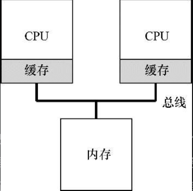  
<center>图 两个有缓存的CPU共享内存</center>  
&ensp;&ensp;这会出现缓存一致性的问题。硬件提供了这个问题的基本解决方案：通过监控内存访问，硬件可以保证获得正确的数据，并保证共享内存的唯一性。  

#### 同步  
&ensp;&ensp;跨CPU访问（尤其是写入）共享数据或数据结构时，需要使用互斥原语（比如锁），才能保证正确性  

#### 缓存亲和度  
&ensp;&ensp;概念：一个进程在某个CPU上运行时，会在该CPU的缓存中维护许多状态。下次该进程在相同CPU上运行时，由于缓存中的数据而执行得更快。相反，在不同的CPU上执行，会由于需要重新加载数据而很慢  

#### 单队列调度（SQMS）  
&ensp;&ensp;复用单处理器调度的基本架构，将所有需要调度的工作放入一个单独的队列中，称之为单队列多处理器调度  
&ensp;&ensp;有几个明显短板：  
1. 缺乏可扩展性。  
 &nbsp;&nbsp;&nbsp;为了保证在多CPU上正常运行，调度程序的开发者需要在代码中通过加锁（locking）来保证原子性，锁可能带来巨大的性能损失，尤其是随着系统中的CPU数增加时。随着这种单个锁的争用增加，系统花费了越来越多的时间在锁的开销上，较少的时间用于系统应该完成的工作  
2. 缓存亲和性  
 &nbsp;&nbsp;&nbsp;假设我们有5个工作  
 &nbsp;&nbsp;&nbsp;  
 &nbsp;&nbsp;&nbsp;一段时间后，假设每个工作依次执行一个时间片，然后选择另一个工作，下面是每个CPU可能的调度序列  
 &nbsp;&nbsp;&nbsp;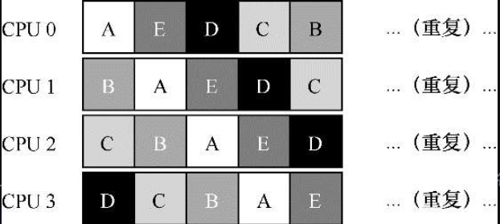  
 &nbsp;&nbsp;&nbsp;由于每个CPU都简单地从全局共享的队列中选取下一个工作执行，因此每个工作都不断在不同CPU之间转移，这与缓存亲和的目标背道而驰。  
#### 多队列调度（MQMS）  
 &nbsp;&nbsp;&nbsp;在MQMS中，基本调度框架包含多个调度队列，每个队列可以使用不同的调度规则，比如轮转或其他任何可能的算法  
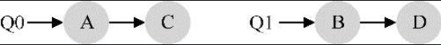  
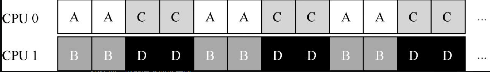  
 &nbsp;&nbsp;&nbsp;MQMS比SQMS有明显的优势，它天生更具有可扩展性。队列的数量会随着CPU的增加而增加，因此锁和缓存争用的开销不是大问题。此外，MQMS天生具有良好的缓存亲和度。所有工作都保持在固定的CPU上，因而可以很好地利用缓存数据。  
 &nbsp;&nbsp;&nbsp;但是，可能会出现下面这种情况  
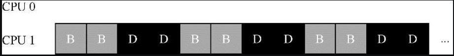  
 &nbsp;&nbsp;&nbsp;这是负载不均，解决方案是：不断地迁移一个或多个工作。  

### 6. 抽象：地址空间  
#### 早期系统  

 &nbsp;&nbsp;&nbsp;操作系统早期是一组函数，在内存中（在本例中，从物理地址0开始），然后有一个正在运行的程序（进程），目前在物理内存中（在本例中，从物理地址64KB开始），并使用剩余的内存。  

#### 多道程序和时分共享  

 &nbsp;&nbsp;&nbsp;多道程序是指多个进程在给定时间准备运行。  
 &nbsp;&nbsp;&nbsp;一种实现时分共享的方法，是让一个进程单独占用全部内存运行一小段时间，然后停止它，并将它所有的状态信息保存在磁盘上（包含所有的物理内存），加载其他进程的状态信息，再运行一段时间  

 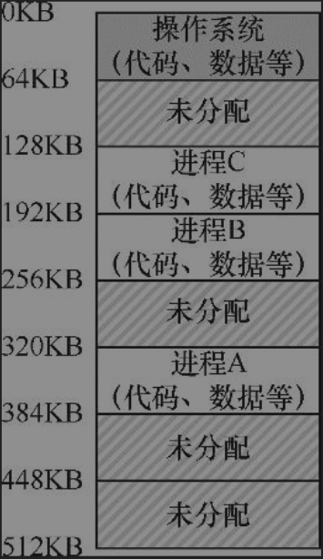  

#### 地址空间  

 &nbsp;&nbsp;&nbsp;一个进程的地址空间包含运行的程序的所有内存状态  
 &nbsp;&nbsp;&nbsp;程序的代码（code，指令）必须在内存中，因此它们在地址空间里。  
 &nbsp;&nbsp;&nbsp;利用栈（stack）来保存当前的函数调用信息，分配空间给局部变量，传递参数和函数返回值  
 &nbsp;&nbsp;&nbsp;堆（heap）用于管理动态分配的、用户管理的内存  

 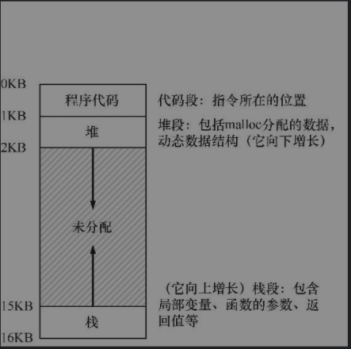  


#### VM目标  

 &nbsp;&nbsp;&nbsp;&nbsp;&nbsp;1. 透明。程序不应该感知到内存被虚拟化的事实，相反，程序的行为就好像它拥有自己的私有物理内存。  

 &nbsp;&nbsp;&nbsp;&nbsp;&nbsp;2. 效率。操作系统应该追求虚拟化尽可能高效（efficient），包括时间上（即不会使程序运行得更慢）和空间上（即不需要太多额外的内存来支持虚拟化。  

 &nbsp;&nbsp;&nbsp;&nbsp;&nbsp;3. 保护。操作系统应确保进程受到保护（protect），不会受其他进程影响，操作系统本身也不会受进程影响。  

### 7.机制：地址转换  

 &nbsp;&nbsp;&nbsp;在实现`CPU虚拟化`时，遵循的一般准则被称为`受限直接访问`（Limited DirectExecution，LDE）。LDE背后的想法很简单：让程序运行的大部分指令直接访问硬件，只在一些关键点（如进程发起系统调用或发生时钟中断）由操作系统介入来确保“在正确时间，正确的地点，做正确的事”。  
 &nbsp;&nbsp;&nbsp;在实现虚拟内存时，我们将追求类似的战略，在实现高效和控制的同时，提供期望的虚拟化。  

 > 关键问题：  
 如何实现高效的内存虚拟化？  
 如何提供应用程序所需的灵活性？  
 如何保持控制应用程序可访问的内存位置，从而确保应用程序的内存访问受到合理的限制？  
 如何高效地实现这一切？  

**利用地址转换，硬件对每次内存访问进行处理（即指令获取、数据读取或写入），将指令中的虚拟（virtual）地址转换为数据实际存储的物理（physical）地址。**  

 &nbsp;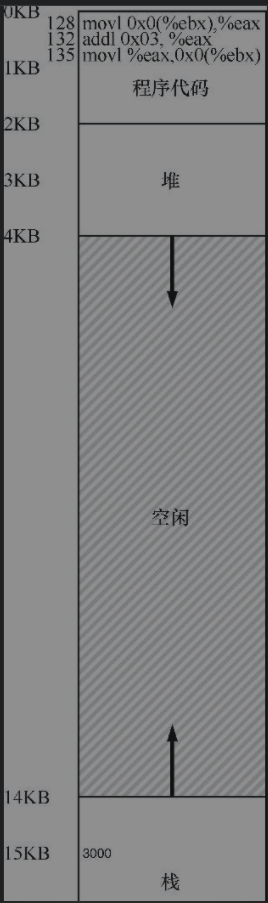  
<center>图 进程及其地址空间</center>  
 &nbsp;&nbsp;&nbsp;然而，对虚拟内存来说，操作系统希望将这个进程地址空间放在物理内存的其他位置，并不一定从地址0开始。因此我们遇到了如下问题：怎样在内存中重定位这个进程，同时对该进程透明（transparent）？怎么样提供一种虚拟地址空间从0开始的假象，而实际上地址空间位于另外某个物理地址？  

 &nbsp;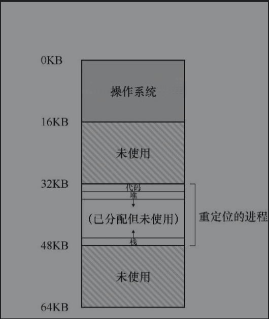  
<center>图 物理内存和单个重定位的进程</center>  

#### 动态（基于硬件）重定位  

 &nbsp;&nbsp;&nbsp;**每个CPU需要两个硬件寄存器：基址（base）寄存器和界限（bound）寄存器，有时称为限制（limit）寄存器。这组基址和界限寄存器，让我们能够将地址空间放在物理内存的任何位置，同时又能确保进程只能访问自己的地址空间。**  

```c  
physical address = virtual address + base  
```  
 &nbsp;&nbsp;&nbsp;进程中使用的内存引用都是虚拟地址（virtual address），硬件接下来将虚拟地址加上基址寄存器中的内容，得到物理地址（physical address），再发给内存系统。  
```c  
128: movl 0x0(%ebx), %eax  
```  
 &nbsp;&nbsp;&nbsp;程序计数器（PC）首先被设置为128。当硬件需要获取这条指令时，它先将这个值加上基址寄存器中的32KB(32768)，得到实际的物理地址32896，然后硬件从这个物理地址获取指令。接下来，处理器开始执行该指令。这时，进程发起从虚拟地址15KB的加载，处理器同样将虚拟地址加上基址寄存器内容（32KB），得到最终的物理地址47KB，从而获得需要的数据。  

---  

 &nbsp;&nbsp;&nbsp;**界限寄存器提供了访问保护**。如果进程需要访问超过这个界限或者为负数的虚拟地址，CPU将触发异常，进程最终可能被终止。界限寄存器的用处在于，它确保了进程产生的所有地址都在进程的地址“界限”中。  

 &nbsp;&nbsp;&nbsp;这种基址寄存器配合界限寄存器的硬件结构是芯片中的（每个CPU一对）。有时我们将CPU的这个负责地址转换的部分统称为内存管理单元（MemoryManagement Unit，MMU）。  

#### 硬件支持：总结  
 &nbsp;&nbsp;&nbsp;操作系统在特权模式（privileged mode，或内核模式，kernel mode），可以访问整个机器资源。应用程序在用户模式（usermode）运行，只能做有限的操作。  
  


#### 操作系统的问题  

 &nbsp;&nbsp;&nbsp;第一，在进程创建时，操作系统必须采取行动，为进程的地址空间找到内存空间。  

 &nbsp;&nbsp;&nbsp;第二，在进程终止时（正常退出，或因行为不端被强制终止），操作系统也必须做一些工作，回收它的所有内存，给其他进程或者操作系统使用。  

 &nbsp;&nbsp;&nbsp;第三，在上下文切换时，操作系统也必须执行一些额外的操作。  

   
 <center>表 动态重定位：操作系统的职责</center>  

 &nbsp;&nbsp;&nbsp;第四，操作系统必须提供异常处理程序（exception handler），或要一些调用的函数，像上面提到的那样。操作系统在启动时加载这些处理程序（通过特权命）。  

   
   

### 8.分段  
 &nbsp;&nbsp;&nbsp;将整个地址空间放入物理内存，那么栈和堆之间的空间并没有被进程使用，却依然占用了实际的物理内存。因此，简单的通过基址寄存器和界限寄存器实现的虚拟内存很浪费。  

#### 分段：泛化的基址/界限  
 &nbsp;&nbsp;&nbsp;在MMU中引入不止一个基址和界限寄存器对，而是给地址空间内的每个逻辑段（segment）一对。一个段只是地址空间里的一个连续定长的区域，在典型的地址空间里有3个逻辑不同的段：代码、栈和堆。  

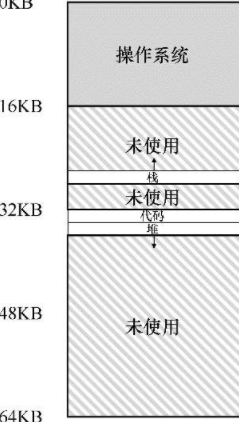  
<center>图 在物理内存中放置段</center>  

#### 应该引用哪个段  

 &nbsp;&nbsp;&nbsp;有3个段，因此需要两位来标识。如果我们用14位虚拟地址的前两位来标识，那么虚拟地址如下所示：  
 &nbsp;&nbsp;&nbsp;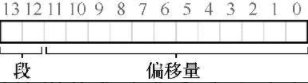  
 &nbsp;&nbsp;&nbsp;那么在我们的例子中，如果前两位是00，硬件就知道这是属于代码段的地址，因此使用代码段的基址和界限来重定位到正确的物理地址。如果前两位是01，则是堆地址，对应地，使用堆的基址和界限。  
 &nbsp;&nbsp;&nbsp;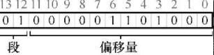  
 &nbsp;&nbsp;&nbsp;从图中可以看到，前两位（01）告诉硬件我们引用哪个段。剩下的12位是段内偏移：0000 0110 1000（即十六进制0x068或十进制104）。因此，硬件就用前两位来决定使用哪个段寄存器，然后用后12位作为段内偏移。偏移量与基址寄存器相加，硬件就得到了最终的物理地址。  


#### 栈怎么办  
 &nbsp;&nbsp;&nbsp;栈是反向增长的  

 &nbsp;&nbsp;&nbsp;  
<center>（用一位区分，比如1代表自小而大增长，0反之）</center>  
 &nbsp;&nbsp;&nbsp;在这个例子中，假设要访问虚拟地址15KB，它应该映射到物理地址27KB。该虚拟地址的二进制形式是：11 1100 0000 0000（十六进制0x3C00）。硬件利用前两位（11）来指定段，但然后我们要处理偏移量3KB。为了得到正确的反向偏移，我们必须从3KB中减去最大的段地址：在这个例子中，段可以是4KB，因此正确的偏移量是3KB减去4KB，即−1KB。只要用这个反向偏移量（−1KB）加上基址（28KB），就得到了正确的物理地址27KB。  


#### 操作系统支持  

 &nbsp;&nbsp;&nbsp;分段也带来了一些新的问题  
 1. 操作系统在上下文切换时应该做什么？要确保各个段寄存器中的内容必须保存和恢复。显然，每个进程都有自己独立的虚拟地址空间，操作系统必须在进程运行前，确保这些寄存器被正确地赋值。  
 2. 管理物理内存的空闲空间  

 &nbsp;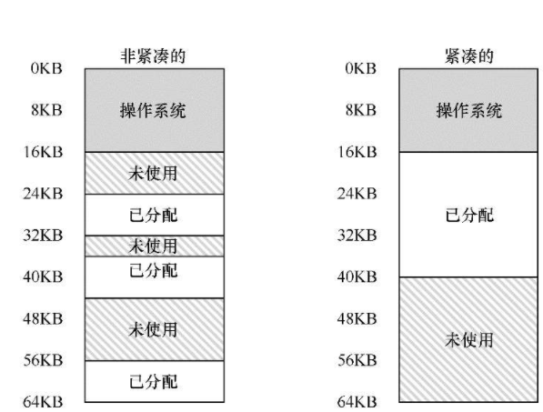  

 该问题有两种解决方案  
 - 紧凑（compact）物理内存，重新安排原有的段。  
> 操作系统先终止运行的进程，将它们的数据复制到连续的内存区域中去，改变它们的段寄存器中的值，指向新的物理地址，从而得到了足够大的连续空闲空间。这样做，操作系统能让新的内存分配请求成功。但是，内存紧凑成本很高，因为拷贝段是内存密集型的，一般会占用大量的处理器时间。  
 - 利用空闲列表管理算法，试图保留大的内存块用于分配。  
> 关的算法可能有成百上千种，包括传统的最优匹配（best-fit，从空闲链表中找最接近需要分配空间的空闲块返回）、最坏匹配（worst-fit）、首次匹配（first-fit）以及像伙伴算法（buddy algorithm）[K68]这样更复杂的算法。  

### 9.空闲空间管理  
#### 底层机制  
##### 分割与合并  
 &nbsp;&nbsp;&nbsp;假设有下面的30字节的堆：  
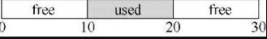  
 &nbsp;&nbsp;&nbsp;使用链表进行描述  
 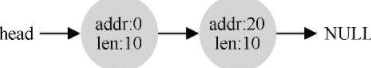  
 &nbsp;&nbsp;&nbsp;假设我们只申请一个字节的内存。这种情况下，分配程序会执行所谓的`分割`（splitting）动作：它找到一块可以满足请求的空闲空间，将其分割，第一块返回给用户，第二块留在空闲列表中。  
 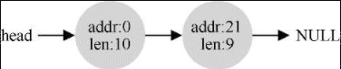  
 &nbsp;&nbsp;&nbsp;许多分配程序中因此也有一种机制，名为合并  
 &nbsp;&nbsp;&nbsp;对于这个（小）堆，如果应用程序调用free(10)，归还堆中间的空间  
 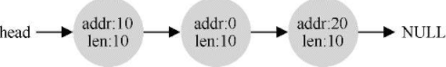  
 &nbsp;&nbsp;&nbsp;问题出现了：尽管整个堆现在完全空闲，但它似乎被分割成了3个10字节的区域。这时，如果用户请求20字节的空间，简单遍历空闲列表会找不到这样的空闲块，因此返回失败。  
 &nbsp;&nbsp;&nbsp;为了避免这个问题，分配程序会在释放一块内存时合并可用空间。想法很简单：在归还一块空闲内存时，仔细查看要归还的内存块的地址以及邻近的空闲空间块  
 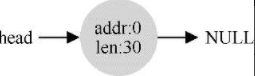  
##### 追踪已分配空间的大小  
 &nbsp;&nbsp;&nbsp;free(void *ptr)接口没有块大小的参数。因此它是假定，对于给定的指针，内存分配库可以很快确定要释放空间的大小，从而将它放回空闲列表。  
 &nbsp;&nbsp;&nbsp;大多数分配程序都会在头块（header）中保存一点额外的信息，它在内存中，通常就在返回的内存块之前。  
 &nbsp;&nbsp;&nbsp;该头块中至少包含所分配空间的大小（这个例子中是20）。它也可能包含一些额外的指针来加速空间释放，包含一个幻数来提供完整性检查，以及其他信息。  
 ```c  
 typedef struct header_t {  
   int size;  
   int magic;  
 }header_t;  
 ```  
 &nbsp;&nbsp;&nbsp;用户调用free(ptr)时，库会通过简单的指针运算得到头块的位置：  
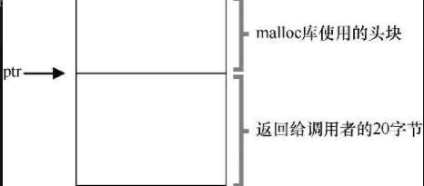  
 &nbsp;&nbsp;&nbsp;实际释放的是头块大小加上分配给用户的空间的大小。因此，如果用户请求N字节的内存，库不是寻找大小为N的空闲块，而是寻找N加上头块大小的空闲块。  
##### 嵌入空闲列表  
 &nbsp;&nbsp;&nbsp;如何在空闲内存自己内部建立这样一个列表呢？  
 &nbsp;&nbsp;&nbsp;假设我们需要管理一个4096字节的内存块（即堆是4KB）。为了将它作为一个空闲空间列表来管理，首先要初始化这个列表。开始，列表中只有一个条目，记录了大小为4096的空间（减去头块的大小）。  
 ```c  
 typedef struct node_t {  
   int size;  
   struct node_t *next;  
 } node_t;  
 ```  
 &nbsp;&nbsp;&nbsp;现在，假设有一个100字节的内存请求。为了满足这个请求，库首先要找到一个足够大小的块。因为只有一个4088字节的块，所以选中这个块。然后，这个块被分割（split）为两块：一块足够满足请求（以及头块，如前所述），一块是剩余的空闲块。假设记录头块为8个字节（一个整数记录大小，一个整数记录幻数）  
 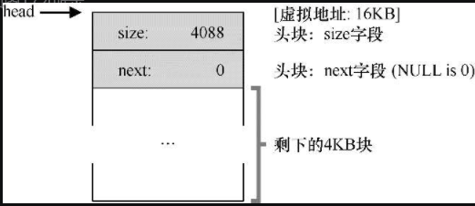  
 图 &nbsp;有一个空闲块的堆  
 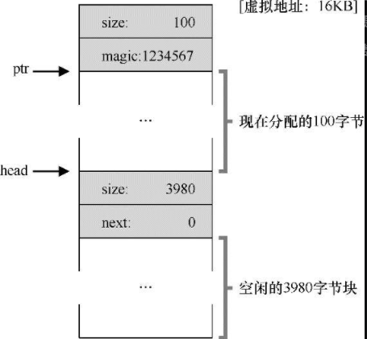  
 图 &nbsp;在一次分配之后的堆  
##### 让堆增长  
 &nbsp;&nbsp;&nbsp;操作系统在执行sbrk系统调用时，会找到空闲的物理内存页，将它们映射到请求进程的地址空间中去，并返回新的堆的末尾地址。  
 #### 基本策略  
 ##### 1. 最优匹配  
 &nbsp;&nbsp;&nbsp;最优匹配（best fit）策略非常简单：首先遍历整个空闲列表，`找到和请求大小一样或更大的空闲块`，然后返回这组候选者中`最小`的一块。这就是所谓的最优匹配（也可以称为最小匹配）。只需要遍历一次空闲列表，就足以找到正确的块并返回。  
 &nbsp;&nbsp;&nbsp;最优匹配背后的想法很简单：选择最接近用户请求大小的块，从而尽量避免空间浪费。然而，这有代价。简单的实现在遍历查找正确的空闲块时，要付出较高的性能代价。  
 ##### 2. 最差匹配  
 &nbsp;&nbsp;&nbsp;最差匹配（worst fit）方法与最优匹配相反，它尝试找`最大`的空闲块，分割并满足用户需求后，将剩余的块（很大）加入空闲列表。最差匹配尝试在空闲列表中保留较大的块，而不是向最优匹配那样可能剩下很多难以利用的小块。但是，最差匹配同样需要遍历整个空闲列表。更糟糕的是，大多数研究表明它的表现非常差，导致过量的碎片，同时还有很高的开销。  
 ##### 3. 首次匹配  
 &nbsp;&nbsp;&nbsp;首次匹配（first fit）策略就是`找到第一个足够大的块`，将请求的空间返回给用户。同样，剩余的空闲空间留给后续请求。首次匹配有速度优势（不需要遍历所有空闲块），但有时会让空闲列表开头的部分有很多小块。因此，分配程序如何管理空闲列表的顺序就变得很重要。一种方式是基于地址排序（address-based ordering）。通过保持空闲块按内存地址有序，合并操作会很容易，从而减少了内存碎片。  
 ##### 4. 下次匹配  
 &nbsp;&nbsp;&nbsp;不同于首次匹配每次都从列表的开始查找，下次匹配（next fit）算法多维护一个指针，指向上一次查找结束的位置。其想法是将对空闲空间的查找操作扩散到整个列表中去，避免对列表开头频繁的分割。这种策略的性能与首次匹配很接近，同样避免了遍历查找。  
 ### 10.分页：介绍  
 &nbsp;&nbsp;&nbsp;操作系统有两种方法，来解决大多数空间管理问题。第一种是将空间分割成不同长度的分片，就像虚拟内存管理中的`分段`。这个解决方法存在固有的问题。具体来说，将空间切成不同长度的分片以后，空间本身会碎片化（fragmented），随着时间推移，分配内存会变得比较困难。  
 &nbsp;&nbsp;&nbsp;将空间分割成固定长度的分片。在虚拟内存中，我们称这种思想为`分页`。分页不是将一个进程的地址空间分割成几个不同长度的逻辑段（即代码、堆、段），而是`分割成固定大小的单元`，每个单元称为一页。相应地，我们把物理内存看成是定长槽块的阵列，叫作页帧分页不是将一个进程的地址空间分割成几个不同长度的逻辑段（即代码、堆、段），而是分割成固定大小的单元，每个单元称为一页。相应地，我们把物理内存看成是`定长槽块的阵列`，叫作`页帧`.  
 #### 引入  
 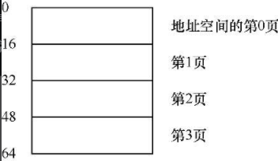  
 &nbsp;&nbsp;&nbsp;虚拟地址空间的页放在物理内存的不同位置。  
 &nbsp;&nbsp;&nbsp;分页有许多优点。可能最大的改进就是灵活性：通过完善的分页方法，操作系统能够高效地提供地址空间的抽象，不管进程如何使用地址空间。  
 &nbsp;&nbsp;&nbsp;另一个优点是分页提供的空闲空间管理的简单性。
 &nbsp;&nbsp;&nbsp;:star:为了记录地址空间的每个虚拟页放在物理内存中的位置，操作系统通常为每个进程保存一个数据结构，称为`页表`（page table）。


